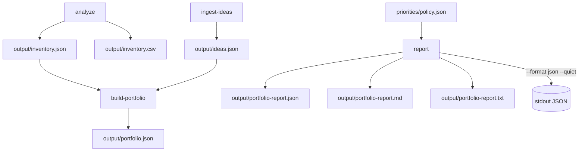
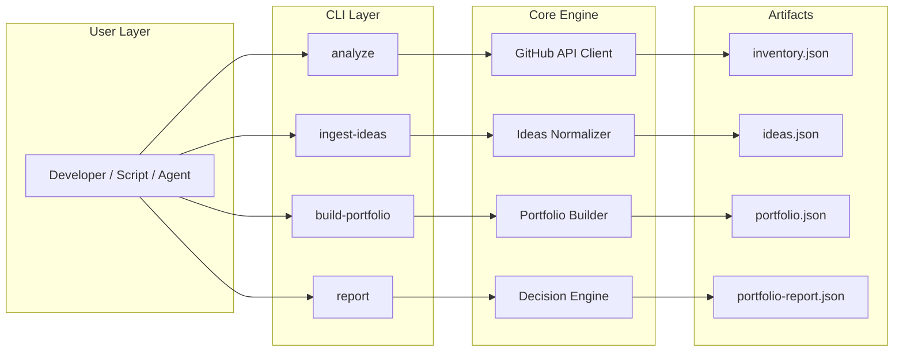

# github-portfolio-analyzer

[](https://www.npmjs.com/package/github-portfolio-analyzer)
[](https://nodejs.org)
[](./LICENSE)
[](https://www.npmjs.com/package/github-portfolio-analyzer)

Build a decision-ready developer portfolio from real GitHub repositories and planned ideas in one deterministic CLI workflow.
This project turns raw repository metadata into actionable prioritization outputs for execution planning.

---
**Tagline:** From repository inventory to execution decisions in minutes.

```
  ◉──●──●──●──◉
         \    /
          ◉──◉
            ↓
  now  ████ ↑↑↑
  next ███░ ↑↑
  later█░░░ ↑
            ↓
  ✓ report.json
```

**What this does:** you run one command. It reads all your GitHub repositories,
scores and prioritizes them, and writes a structured JSON report ready to feed
your portfolio site — automatically, without manual curation.

## Flow Overview



## Table of Contents

- [Flow Overview](#flow-overview)
- [Why This Tool Exists](#why-this-tool-exists)
- [Project Overview](#project-overview)
- [Installation](#installation)
- [Quick Start](#quick-start)
- [CLI Commands](#cli-commands)
- [CLI Flags](#cli-flags)
- [Required and Optional Inputs](#required-and-optional-inputs)
- [Output Artifacts](#output-artifacts)
- [End-to-End Example](#end-to-end-example)
- [Machine Integration](#machine-integration)
- [3-Minute Quickstart](#3-minute-quickstart)
- [End-to-End Tutorial](#end-to-end-tutorial)
- [Command Reference](#command-reference)
- [Integration Contract](#integration-contract)
- [Exit Codes](#exit-codes)
- [Optional Policy Overlay and Explain Mode](#optional-policy-overlay-and-explain-mode)
- [Output Directory Map](#output-directory-map)
- [Data Contracts](#data-contracts)
- [Decision Model (Report)](#decision-model-report)
- [Determinism and Time Rules](#determinism-and-time-rules)
- [nextAction Validation](#nextaction-validation)
- [Architecture](#architecture)
- [Testing and Quality](#testing-and-quality)
- [Troubleshooting](#troubleshooting)
- [License and Contribution](#license-and-contribution)

## Documentation

- [Agent Guide](AGENT_GUIDE.md)
- [Integration Guide](docs/INTEGRATION.md)
- [Analyzer Manifest](analyzer.manifest.json)
- [Portfolio Report Schema](schemas/portfolio-report.schema.json)

## Why This Tool Exists

Most portfolios are incomplete: repositories are analyzed, but pending ideas live in notes and never enter prioritization.
`github-portfolio-analyzer` unifies both streams and emits stable artifacts for reporting, planning, and backlog strategy.

## Project Overview

`github-portfolio-analyzer` is a deterministic CLI that analyzes GitHub repositories and project ideas, then produces portfolio and decision-report artifacts for execution planning.

Design goals:

- deterministic outputs for the same inputs
- explainable ranking and priority signals
- tool-agnostic artifacts (JSON, Markdown, ASCII)
- orchestration-friendly CLI behavior for scripts, agents, and CI

## Installation

```bash
npm install -g github-portfolio-analyzer
```

Verify the installation:

```bash
github-portfolio-analyzer --version
```

If the global binary is not available, run directly:

```bash
node bin/github-portfolio-analyzer.js --version
```

## Quick Start

Minimal workflow:

```bash
github-portfolio-analyzer analyze
github-portfolio-analyzer ingest-ideas
github-portfolio-analyzer build-portfolio
github-portfolio-analyzer report
```

What each step does:

- `analyze`: pulls repository metadata from GitHub API and writes inventory artifacts
- `ingest-ideas`: normalizes/scoring ideas into `ideas.json`
- `build-portfolio`: merges repositories and ideas into portfolio artifacts
- `report`: creates decision-oriented report artifacts (JSON/MD/TXT)

## CLI Commands

- `analyze`: fetch and score GitHub repositories into inventory outputs
- `ingest-ideas`: ingest idea records from JSON or interactive prompt
- `build-portfolio`: merge repository inventory and ideas into unified portfolio outputs
- `report`: generate decision reports from portfolio artifacts

## CLI Flags

- `--version`: print CLI version only
- `--policy <path>`: apply optional policy overlay when generating reports
- `--explain`: print NOW-band ranking explanation to console
- `--output <dir>`: report-only output directory override for report artifacts
- `--format json`: emit report JSON to stdout (artifacts are still written)
- `--quiet`: suppress non-error logs
- `--strict`: fail on unknown flags and invalid usage with exit code `2`

## Required and Optional Inputs

Required inputs depend on the command path:

- For `analyze`: `.env` with `GITHUB_TOKEN` (and usually `GITHUB_USERNAME`)
- For `report`: `output/portfolio.json` must exist

Optional inputs:

- `ideas/input.json` (or custom path via `ingest-ideas --input`)
- `priorities/policy.json` for manual priority overlays in `report`
- `--as-of YYYY-MM-DD` for deterministic snapshot control during `analyze`

Create a local policy file:

```bash
cp priorities/policy.example.json priorities/policy.json
```

`priorities/policy.json` is local and git-ignored by design.

## Output Artifacts

Primary artifacts:

- `output/inventory.json`
- `output/portfolio.json`
- `output/portfolio-report.json`
- `output/portfolio-report.md`
- `output/portfolio-report.txt`

Output directory control:

- `report --output <dir>` writes report artifacts to a custom directory
- Pipeline commands also support `--output-dir <dir>` for their output roots

## End-to-End Example

```bash
github-portfolio-analyzer analyze --as-of 2026-03-03
github-portfolio-analyzer ingest-ideas --input ./ideas/input.json
github-portfolio-analyzer build-portfolio
github-portfolio-analyzer report --format json
```

After this run, you should have (in `output/` by default):

- `inventory.json` and `inventory.csv`
- `ideas.json`
- `portfolio.json` and `portfolio-summary.md`
- `portfolio-report.json`, `portfolio-report.md`, `portfolio-report.txt`

## Machine Integration

Use this CLI from scripts, CI jobs, or agent runtimes with deterministic artifacts and predictable exit codes.

Programmatic JSON via stdout:

```bash
github-portfolio-analyzer report --format json --quiet
```

Custom report output directory:

```bash
github-portfolio-analyzer report --output ./runs/run-001
```

`--format json --quiet` is recommended for machine consumers because stdout contains only JSON unless an error occurs.
See [Integration Contract](#integration-contract) and the dedicated [Integration Guide](docs/INTEGRATION.md).

## 3-Minute Quickstart

### 1) Requirements

- Node.js `22+`
- GitHub Personal Access Token (PAT) for `analyze`

### 2) Create a GitHub PAT (short version)

Create a token in GitHub settings and store it in `.env`.
Use the minimum read permissions needed to list repos and inspect repository files/workflows:

- **Fine-grained token:** repository `Metadata: Read`, `Contents: Read`, `Actions: Read`
- **Classic token (fallback):** `repo` scope (read usage by this CLI)

### 3) Install and configure

```bash
npm install
cp .env.example .env
```

Set values in `.env`:

```dotenv
GITHUB_TOKEN=your_github_token_here
GITHUB_USERNAME=your_github_username_here
```

### 4) Run the core pipeline

```bash
github-portfolio-analyzer analyze --as-of 2026-03-03
github-portfolio-analyzer ingest-ideas
github-portfolio-analyzer build-portfolio
github-portfolio-analyzer report --format all
```

Example console snippet:

```bash
$ github-portfolio-analyzer analyze --as-of 2026-03-03
Analyzed 51 repositories for octocat.
Wrote output/inventory.json.
Wrote output/inventory.csv.
```

## End-to-End Tutorial

### Step 1: Analyze repositories

```bash
github-portfolio-analyzer analyze --as-of 2026-03-03
```

What happens:

- Authenticates with GitHub API
- Fetches all repos with pagination
- Computes structural health, activity, maturity, score, taxonomy
- Writes `inventory.json` and `inventory.csv`

### Step 2: Ingest ideas

Default file mode:

```bash
github-portfolio-analyzer ingest-ideas
```

Interactive mode:

```bash
github-portfolio-analyzer ingest-ideas --prompt
```

What happens:

- Normalizes idea records
- Scores ideas
- Applies taxonomy defaults/inference with provenance metadata
- Normalizes `nextAction` to canonical format

### Step 3: Build merged portfolio

```bash
github-portfolio-analyzer build-portfolio
```

What happens:

- Merges repos + ideas
- Preserves deterministic ordering
- Writes `portfolio.json`, per-project markdown pages, and `portfolio-summary.md`

### Step 4: Generate decision report

```bash
github-portfolio-analyzer report --format all
```

What happens:

- Reads `portfolio.json` (required)
- Optionally reads `inventory.json` for richer repo completion signals
- Computes completion level, effort estimate, and priority band
- Writes ASCII + Markdown + JSON report artifacts

## Command Reference

| Command | Purpose | Key Options |
|---|---|---|
| `analyze` | Build repository inventory from GitHub API | `--as-of YYYY-MM-DD`, `--output-dir PATH` |
| `ingest-ideas` | Add/update idea records | `--input PATH`, `--prompt`, `--output-dir PATH` |
| `build-portfolio` | Merge repos + ideas into portfolio outputs | `--output-dir PATH` |
| `report` | Produce decision-oriented report artifacts | `--output-dir PATH`, `--format ascii\|md\|json\|all` |

Default for `report --format` is `all`.

## Integration Contract

This section defines the stable integration points for external tools and orchestrators.
For a fast first run path, start with [Quick Start](#quick-start).

### Available commands

- `analyze`
- `ingest-ideas`
- `build-portfolio`
- `report`

### Relevant report flags

- `report --policy`
- `report --explain`
- `report --quiet`

### Canonical analyzer outputs

- `output/inventory.json`
- `output/portfolio.json`
- `output/portfolio-report.json`

### Machine-readable interface files

- `analyzer.manifest.json`: static command/output manifest for external orchestrators
- `schemas/portfolio-report.schema.json`: JSON Schema for `portfolio-report.json` validation

### Optional local configuration

- `priorities/policy.json`
- This file is local and git-ignored.
- Create it by copying:
  `priorities/policy.example.json` -> `priorities/policy.json`

### Optional strict mode

- Use `--strict` to fail on unknown flags with exit code `2`.
- Without `--strict`, existing permissive parsing behavior remains unchanged.

### CLI version

You can get the CLI version with:

```bash
github-portfolio-analyzer --version
```

### JSON schema

- `schemas/portfolio-report.schema.json` validates the `output/portfolio-report.json` structure.
- External systems can use this schema together with `analyzer.manifest.json` as the integration contract.

## Exit Codes

- `0`: success
- `1`: operational failure (runtime/file/network/auth errors)
- `2`: invalid usage (for example invalid command or `--strict` unknown flag)

## Optional Policy Overlay and Explain Mode

The report command supports an optional policy overlay to guide prioritization without changing project taxonomy, state, or score.
When no policy is provided, ranking remains neutral and deterministic using the built-in heuristics.

### CLI examples

```bash
github-portfolio-analyzer report --format all
github-portfolio-analyzer report --policy ./priorities/policy.json --format json
github-portfolio-analyzer report --priorities ./priorities/policy.json --explain
```

### Local policy file setup

Use the example as a starting point and keep your real policy file local:

```bash
cp priorities/policy.example.json priorities/policy.json
```

`priorities/policy.json` is git-ignored on purpose (local preferences).
`priorities/policy.example.json` should remain tracked as the shared template.

### Minimal policy example

```json
{
  "version": 1,
  "rules": [
    {
      "id": "focus-core-tooling",
      "match": {
        "type": ["repo"],
        "category": ["tooling"],
        "state": ["active", "stale"]
      },
      "effects": {
        "boost": 10,
        "tag": "core"
      },
      "reason": "Prioritize currently maintainable internal tooling."
    }
  ],
  "pin": [
    {
      "slug": "developer-onboarding-checklist-generator",
      "band": "now",
      "tag": "manual-priority"
    }
  ]
}
```

### Policy behavior guarantees

- Rules are applied in deterministic `id` order.
- Boosts are cumulative.
- Pin band has highest precedence.
- `forceBand` uses strongest precedence: `now > next > later > park`.
- Policy overlay only affects report-level priority fields (`finalPriorityScore`, `priorityBand`, tags/overrides).
- Taxonomy fields, item score, and item state remain unchanged.
- The tool remains deterministic across runs for the same inputs.

## Output Directory Map

```text
/output
  /projects
    {project-slug}.md
  inventory.json
  inventory.csv
  ideas.json
  portfolio.json
  portfolio-summary.md
  portfolio-report.json
  portfolio-report.md
  portfolio-report.txt
```

Artifact roles:

- `inventory.json`: repository-only enriched source (includes taxonomy + taxonomyMeta)
- `ideas.json`: ideas-only normalized source
- `portfolio.json`: merged source of truth
- `portfolio-summary.md`: high-level portfolio summary (state sections + top 10)
- `portfolio-report.*`: decision-oriented planning report in machine and human formats

## Data Contracts

### Taxonomy contract (all portfolio items)

Each `portfolio.json.items[]` entry includes:

- `type`: `repo | idea`
- `category`: `product | tooling | library | learning | content | infra | experiment | template`
- `state`: `idea | active | stale | dormant | abandoned | archived | reference-only`
- Auto-classified repository inactivity uses `dormant`; `abandoned` remains supported for manual curation.
- `strategy`: `strategic-core | strategic-support | opportunistic | maintenance | parked`
- `effort`: `xs | s | m | l | xl`
- `value`: `low | medium | high | very-high`
- `nextAction`: `"<Verb> <target> — Done when: <measurable condition>"`
- `taxonomyMeta`: per-field provenance (`default | user | inferred`). For repositories, `sources.category` is always `user` (when set manually) or `inferred` (heuristic) — never `default`.

`inventory.json.items[]` includes the same taxonomy fields and `taxonomyMeta` for repositories.

### Report contract

`portfolio-report.json` includes:

- `meta` (generatedAt, asOfDate, owner, counts)
- `summary` (state counts, top10 by score, now/next/later/park)
- `matrix.completionByEffort` (`CL0..CL5` by `xs..xl`)
- `items[]` with decision fields (`completionLevel`, `effortEstimate`, `priorityBand`, `priorityWhy`, `category`)

## Decision Model (Report)

Every repository passes through a deterministic scoring pipeline:

```mermaid
flowchart LR
    subgraph top [ ]
        direction LR
        A([repo metadata]) --> B(inferRepoCategory) --> C([category]) --> D(scoreRepository) --> E([score 0–100])
    end
    subgraph mid [ ]
        direction RL
        J(computePriorityBand) <-- I([effort xs-xl]) <-- H(computeEffortEstimate) <-- G([CL 0–5]) <-- F(computeCompletionLevel)
    end
    E --> F
    E -. feeds .-> J
    G -. feeds .-> J
    J --> park([park]) & later([later]) & next([next]) & now([now])
```

### Score

Each repository receives a score from 0 to 100 based on observable signals.
Signal weights depend on the project's **category**, inferred automatically
from its name, description, and GitHub topics.

| Signal | product | tooling | library | content | learning | infra | experiment | template |
|---|:---:|:---:|:---:|:---:|:---:|:---:|:---:|:---:|
| baseline | — | — | — | **25** | **35** | — | **45** | **30** |
| pushed (90d) | 25 | 25 | 20 | 25 | 20 | 25 | 20 | 10 |
| README | 15 | 15 | 20 | 15 | 15 | 20 | 15 | **25** |
| license | 10 | 10 | **20** | ✗ | ✗ | 10 | ✗ | 10 |
| tests | 25 | 20 | **25** | ✗ | ✗ | 10 | ✗ | 5 |
| stars > 1 | 5 | 5 | 10 | 5 | 5 | 5 | 5 | 10 |
| updated (180d) | 20 | 25 | 5 | **30** | **25** | **30** | 15 | 10 |

`✗` = irrelevant for this category (weight 0). `library` penalizes missing
license most heavily. `experiment` and `learning` skip tests and license entirely.

Example — a `content` repo with no license and no tests still scores 95:

```
"prompt-library"  category: content
────────────────────────────────────
baseline          +25
pushed 10d ago    +25
has README        +15
has license        +0  (irrelevant for content)
has tests          +0  (irrelevant for content)
updated this month +30
────────────────────────────────────
score              95
```

See [docs/SCORING_MODEL.md](docs/SCORING_MODEL.md) for the full weight table
and numeric examples for every category.

### Completion Level

Reflects structural maturity, regardless of category. Ideas always default to CL 0.

| CL | Label | Condition |
|---|---|---|
| 0 | Concept only | no README, or `type: idea` |
| 1 | Documented | has README |
| 2 | Structured baseline | has `package.json` (or non-JS repo ≥ 500 KB) |
| 3 | Automated workflow | CL 2 + CI |
| 4 | Tested workflow | CL 3 + tests |
| 5 | Production-ready candidate | CL 4 + score ≥ 70 |

### Effort Estimate

How much work remains to bring a project to its next meaningful state.
Inferred automatically from repository size and completion level when not set manually.
`effortEstimate` is a report-only field — it never overwrites the taxonomy `effort`.

| Estimate | Size | CL | What it means |
|---|---|---|---|
| `xs` | < 100 KB | ≤ 2 | A few hours. Easy to restart from scratch. |
| `s` | < 500 KB | ≤ 3 | A day or two. Focused sprint. |
| `m` | < 5 MB | any | About a week. Needs planning. |
| `l` | < 20 MB | any | Multiple weeks. Real commitment required. |
| `xl` | ≥ 20 MB | any | A long-term project. Strategic investment. |

### Priority Band

The base score is adjusted by state, completion, and effort to produce a
final `priorityScore`, which determines the band.

| Modifier | Condition | Effect |
|---|---|---|
| State boost | `active` | +10 |
| State boost | `stale` | +5 |
| State penalty | `dormant`, `abandoned`, or `archived` | −20 |
| Quick-win boost | CL 1, 2, or 3 | +10 |
| Effort penalty | `l` or `xl` | −10 |

`priorityScore` has no lower bound — it can go negative.

| Band | Range | Meaning |
|---|---|---|
| `park` | < 45 | Needs a decision before any investment. Dormant, low signal, or intentionally paused. |
| `later` | 45–64 | Viable but not urgent. Can return when backlog has room. |
| `next` | 65–79 | Strong candidate. High score but large effort, or active with average score. |
| `now` | ≥ 80 | High confidence. Active project, good score, low effort — or manually pinned. |

Example — modifiers can push a `park`-bound project below zero:

```
"old-monolith"  category: product
──────────────────────────────────
baseline         0
pushed 400d ago +0   (> 90 days)
has README      +15
has license     +10
no tests        +0
updated 200d ago +0  (> 180 days)
──────────────────────────────────
score            25

state=dormant    −20
effort=xl        −10
──────────────────────────────────
priorityScore    −5  → park
```

## Determinism and Time Rules

- `asOfDate` is UTC-based (`--as-of` or UTC today once per `analyze` run)
- `inventory.json.meta.asOfDate` persists snapshot date
- `portfolio.json.meta.asOfDate` copies inventory asOfDate, or `null` when inventory is missing
- Item-level timestamps are not persisted
- Deterministic ordering:
  - inventory repos by `fullName` ascending
  - ideas by `slug` ascending
  - portfolio by `score` descending then `slug` ascending

## nextAction Validation

Required canonical format:

`"<Verb> <target> — Done when: <measurable condition>"`

Robust input support:

- Accepts fallback marker `" - Done when:"`
- Normalizes to em dash marker `"— Done when:"`
- Throws clear error for invalid format

## Architecture

```text
bin/
  github-portfolio-analyzer.js
src/
  commands/ (analyze, ingest-ideas, build-portfolio, report)
  core/     (classification, scoring, taxonomy, ideas, portfolio, report)
  github/   (api client, pagination, structural inspection)
  io/       (json/csv/markdown/report writers)
  utils/    (args, time, slug, retry, concurrency, nextAction)
```

### Architecture Overview



Implementation characteristics:

- Minimal dependencies (`dotenv` only)
- Built-in `fetch`
- GitHub API only (no repository cloning)
- Retry/backoff on 403/429 and transient failures
- Per-repo error isolation during analysis

## Testing and Quality

Run the full suite:

```bash
npm test
```

Coverage includes:

- activity/maturity/scoring boundaries
- category inference from repository name, description, and topics
- category-aware scoring weights and category preservation for user-specified values
- taxonomy presence and provenance behavior
- `nextAction` validation and normalization
- portfolio merge determinism
- report completion logic, priority mapping, and deterministic model generation
- `category` propagation to report items and all summary bands

## Troubleshooting

### Missing `GITHUB_TOKEN`

`analyze` fails fast with a clear error when token is missing.
`ingest-ideas`, `build-portfolio`, and `report` still run without GitHub authentication.

### Missing `portfolio.json` for report

`report` requires `output/portfolio.json` and will fail with:

- `Missing required input: output/portfolio.json. Run build-portfolio before report.`

### Report with no inventory

If `inventory.json` is absent:

- report still runs from `portfolio.json`
- owner is `null`
- completion signals are best-effort from portfolio fields

## License and Contribution

Use this repository as a base for portfolio automation workflows and adapt heuristics for your organization.
Contributions should preserve deterministic contracts and avoid adding non-essential dependencies.
