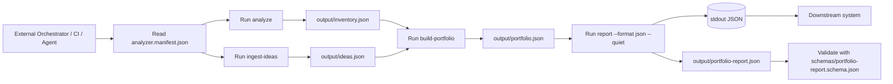
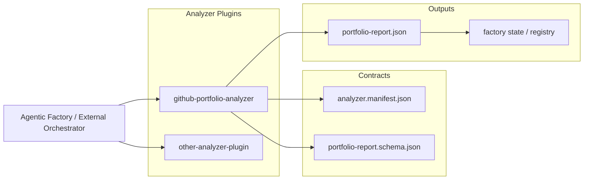

# Integration Guide

## Tool Role

`github-portfolio-analyzer` is a deterministic decision engine that transforms repository and idea data into structured portfolio and report artifacts.
It is designed for human workflows and machine orchestration (CI pipelines, agent runtimes, and automation scripts).

## CLI Workflow

```bash
github-portfolio-analyzer analyze
github-portfolio-analyzer ingest-ideas
github-portfolio-analyzer build-portfolio
github-portfolio-analyzer report --format json --quiet
```

## Machine-readable Interfaces

- `analyzer.manifest.json`: static capabilities/outputs manifest for discovery.
- `schemas/portfolio-report.schema.json`: JSON Schema for validating `portfolio-report.json`.

## Programmatic Usage Example

```bash
github-portfolio-analyzer report --format json --quiet
```

When this command succeeds, stdout contains JSON only.
Stderr remains empty unless an error occurs.

## Artifact Contract

Core artifacts consumed by external systems:

- `output/inventory.json`
- `output/portfolio.json`
- `output/portfolio-report.json`

## Exit Codes

- `0`: success
- `1`: operational error
- `2`: invalid usage

## Integration Flow



## Analyzer as Plugin

`github-portfolio-analyzer` can run as a plugin inside larger orchestration systems such as Agentic Factory, alongside other analyzers that share manifest/schema contracts.


